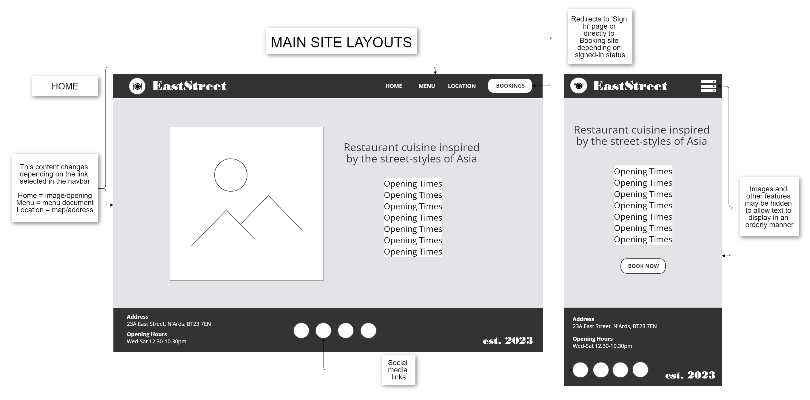
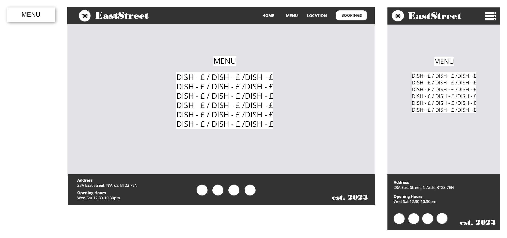
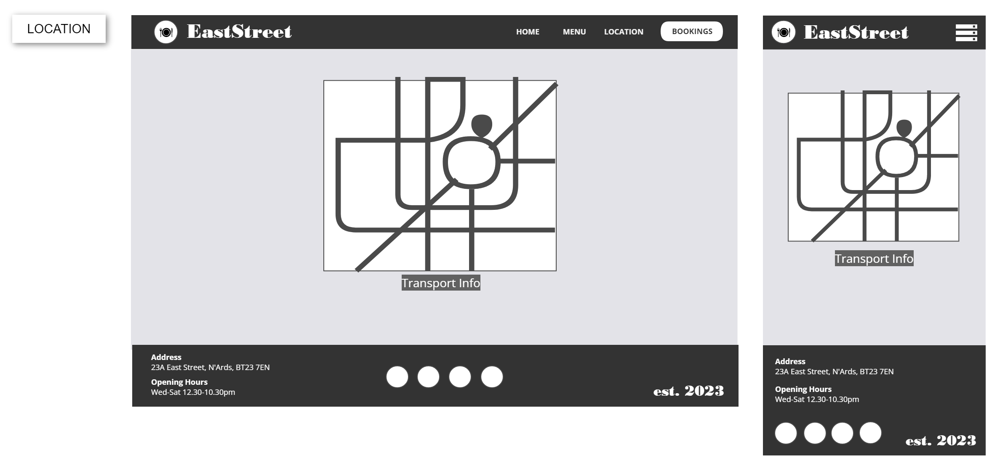
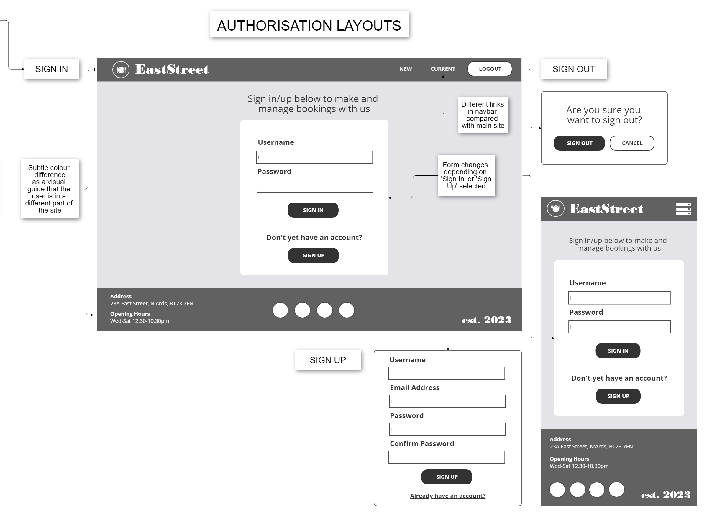
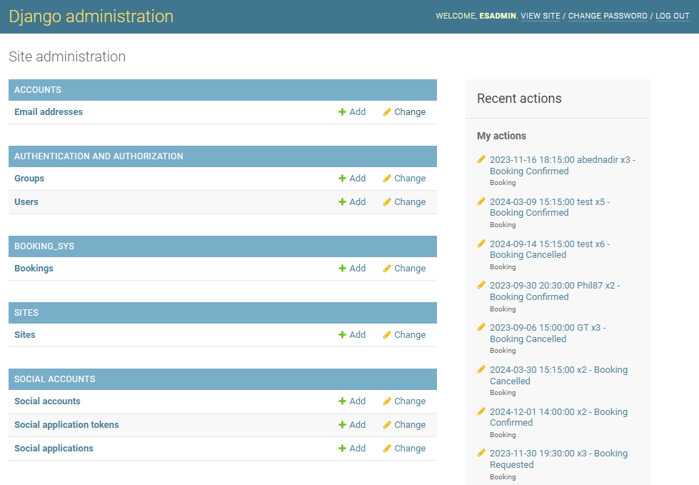
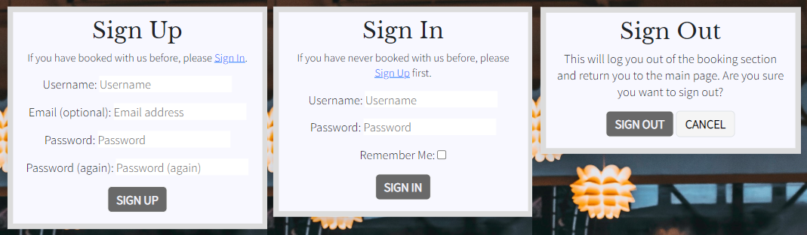
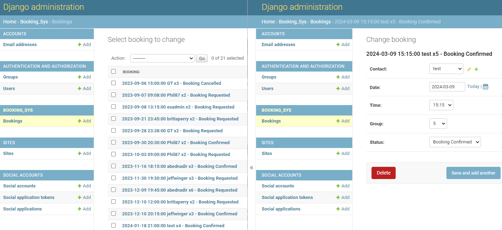

# EastSt.

East Street Restaurant (stylised as 'EastSt.') is a fictional establishment located on 23A East Street, Newtownards, Northern Ireland.

This site has been designed to allow imagined customers the ability to access info regarding and place bookings with the restaurant, as well featuring an administrative area allowing restaurant managers to oversee the bookings of all users so that they can properly run the restaurant.

[LIVE LINK TO SITE](https://east-street-bc0671035c95.herokuapp.com/)<br>
_Note: to open links in a new tab, hold CTRL + Click_


## Table Of Contents
- [Introduction](#eastst)
- [Strategy](#strategy)
  - [Milestone 1 - Initial Setup](#milestone-1---initial-setup)
  - [Milestone 2 - Main Site Pages](#milestone-2---main-site-pages)
  - [Milestone 3 - Booking Site Access](#milestone-3---booking-site-access)
  - [Milestone 4 - CRUD Functionality](#milestone-4---crud-functionality)
  - [Milestone 5 - Additional Coding](#milestone-5---additional-coding)
- [Scope](#scope)
- [Structure](#structure)
- [Skeleton](#skeleton)
  - [Wireframe Models](#wireframe-models)
  - [Database Model](#database-model)
- [Surface](#surface)
  - [Design & Typography](#design--typography)
  - [Features Implemented](#features-implemented)
  - [Features To Be Implemented](#features-to-be-implemented)
  - [Technology & Resources](#technology--resources)
- [Testing](#testing)
- [Deployment](#deployment)
  - [Heroku Deployment](#heroku-deployment)
  - [Forking The Repository](#forking-the-respository)
  - [Cloning The Repository](#cloning-the-respository)
- [Credits & Acknowledgements](#credits--acknowledgements)

## UX Design

The site is aimed at helping customers to easily access information regarding the restaurant opening/closing times, menu, and location, as well as providing a simple interface for making, viewing, updating, and deleting bookings made with the restaurant.

The site is also designed with the restaurant manager/site administrator in mind, providing an admin-only area accessible via https://east-street-bc0671035c95.herokuapp.com/admin

## Strategy

### Milestones & User Stories
This project was developed with 5 milestones (epics) in mind. From each of these milestones a number of dev goals and user stories were created, each one given a prioritisation using the MoSCoW method. The detail of these milestones, goals and stories is outlined below; further detail regarding sprints, MoSCoW designation and acceptance criteria (covered under Structure) are included on the [GitHub Projects Kanban Board](https://github.com/users/ndsurgenor/projects/5) created for the project.


#### Milestone 1 - Initial Setup
- 1.1 - Dev Goal: set up Django and its supporting libraries via the IDE in order for development to begin
- 1.2 - Dev Goal: set up the Django project and app
- 1.3 - Dev Goal: create an early Heroku deployment to ensure all is working from the very start and allow continuous testing throughout production

#### Milestone 2 - Main Site Pages
- 2.1 - User Story: as a Site Visitor/User I want to access info/links from the home page so that I can easily discern information and make a booking
- 2.2 - User Story: as a Site Visitor/User I want to view the opening times so that I can see when the restaurant is open before I book
- 2.3 - User Story: as a Site Visitor/User I want to view the restaurant menu so that I can see what food is available before booking
- 2.4 - User Story: as a Site Visitor/User I want to view the location/address of the restaurant so that I know where the restaurant is located

#### Milestone 3 - Booking Site Access
- 3.1 - User Story: as a Site Admin I want to view all customer details/bookings so that I can plan for required table numbers/sizes
- 3.2 - User Story: as a Site Visitor I want to sign up to the site so that I can make bookings
- 3.3 - User Story: as a Site User I want to sign in to the site so that I can make/view/adjust/delete bookings
- 3.4 - User Story: as a Site User I want to be able to log out from the booking area so that no-one can change my details inadvertently or otherwise

#### Milestone 4 - CRUD Functionality
- 4.1 - User Story: as a Site User I want to make an online booking so that I can secure a table for a particular date, time & group size
- 4.2 - User Story: as a Site User I want to view my booking(s) so that I can see if it has been recorded correctly and remind myself of its details
- 4.3 - User Story: as a Site User I want to access/adjust my booking(s) so that I can correct an error/make necessary changes
- 4.4 - User Story: as a Site User I want to cancel my booking(s) so that it/they no longer appear(s) on the system
- 4.5 - User Story: as a Site Admin I want to have the ability to accept/reject new bookings so that I can manage customer numbers within the restaurant

#### Milestone 5 - Additional Coding
- 5.1 - User Story: as a Site Admin I want to prevent bookings being made for unavailable dates/times so that bookings are not made when the restaurant is closed
- 5.2 - User Story: as a Site User I want to have on-screen confirmation during the authorisation/booking process so that I know my input has been recorded correctly
- 5.3 - Dev Goal: set up 404, 403 and 500 pages to correctly handle access/server issues when the site is in use

## Scope

Using these milestones, goals, and stories to guide my thinking, the following was planned as the Scope of the project:

- Responsive Design allowing full functionality and appropriate resizing on all devices from 360px upwards
- Use of Toggle-menu and hidden elements (e.g. home page image) when site is viewed on tablet/mobile devices
- A main section of the site containing all restaurant information (non-restricted access):
  - Opening Times
  - Menu
  - Location
- A booking section of the site allowing CRUD functionality for end users (restricted access):
  - Sign Up/In/Out
  - Make Bookings
  - View Bookings
  - Adjust Bookings
  - Cancel Bookings
- An admin backend to the site allowing CRUD functionality for site admin (restricted access):
  - View All Bookings
  - Confirm Bookings

## Structure

With Strategy and Scope now in place, focus shifted to setting acceptance criteria for each of the above, thereby informing exactly what features to include as part of the project. These acceptance criteria were added to each Dev Goal and User Story on the aforementioned Kanban board to act as an insurance that task would be completed to the fullest extent needed.

### Features
Hovering over a reference (Ref) number below will display a description of that Dev Goal/User Story while clicking the link will return you to the relevant Milestone section of this document.

**Milestone**|**Ref**|**Type**|**Acceptance Criteria/Features**
:-----:|:-----:|:-----:|-----
Initial Setup|[1.1](#milestone-1---initial-setup "Set up Django and its supporting libraries via the IDE in order for development to begin")|Dev Goal|<ul><li>Install server: django-gunicorn</li><li>Install PostgreSQL library: dj_database_url psycopg2</li><li>Install image host: dj3-cloudinary-storage</li><li>Install sign-up/in/out functionality: django-allauth</li><li>Create requirements.txt file</li></ul>
Initial Setup|[1.2](#milestone-1---initial-setup "Set up the Django project and app")|Dev Goal|<ul><li>Create Django project: east-street</li><li>Create app: booking-sys</li><li>Update the settings.py file</li><li>Migrate changes</li></ul>
Initial Setup|[1.3](#milestone-1---initial-setup "Create an early Heroku deployment to ensure all is working from the very start and allow continuous testing throughout production")|Dev Goal|<ul><li>Create app on Heroku</li><li>Set up ElephantSQL</li><li>Set up the env.py file</li><li>Update the settings.py file</li><li>Set config vars and deploy app</li></ul>
Main Site|[2.1](#milestone-2---main-site-pages "As a Site Visitor/User I want to access info/links from the home page so that I can easily discern information and make a booking")|User Story|<ul><li>A home page displaying opening times of the restaurant</li><li>A home page also displaying a quick link to the booking area of the site</li><li>A navbar providing clear links to menu and location info</li><li>A highlighted link to the booking area in the navbar</li><li>A footer providing summarised info and social links</li></ul>
Main Site|[2.2](#milestone-2---main-site-pages "As a Site Visitor/User I want to view the opening times so that I can see when the restaurant is open before I book")|User Story|<ul><li>A static page showing the opening day/times of the restaurant</li><li>Elements that display/resize/scroll when viewed on different sized devices</li></ul>
Main Site|[2.3](#milestone-2---main-site-pages "As a Site Visitor/User I want to view the restaurant menu so that I can see what food is available before booking")|User Story|<ul><li>A static page showing the food and prices within the restaurant</li><li>Elements that display/resize/scroll when viewed on different sized devices</li></ul>
Main Site|[2.4](#milestone-2---main-site-pages "As a Site Visitor/User I want to view the location/address of the restaurant so that I know where the restaurant is located")|User Story|<ul><li>A static page showing the map location and transport options for the restaurant</li><li>Elements that display/resize/scroll when viewed on different sized devices</li></ul>
Booking Site |[3.1](#milestone-3---booking-site-access "As a Site Admin I want to view all customer details/bookings so that I can plan for required table numbers/sizes")|User Story|<ul><li>An admin area only allowing access to the site admin/superuser</li><li>A link to the database to clearly display the details of each booking i.e. entry in the database</li></ul>
Booking Site|[3.2](#milestone-3---booking-site-access "As a Site Visitor I want to sign up to the site so that I can make bookings")|User Story|<ul><li>A sign-up form requiring username and password details</li></ul>
Booking Site|[3.3](#milestone-3---booking-site-access "As a Site User I want to sign in to the site so that I can make/view/adjust/delete bookings")|User Story|<ul><li>A sign-in form requiring username and password details</li></ul>
Booking Site|[3.4](#milestone-3---booking-site-access "As a Site User I want to be able to log out from the booking area so that no-one can change my details inadvertently or otherwise")|User Story|<ul><li>A sign-out form requiring the user to confirm that they wish to sign out</li></ul>
CRUD|[4.1](#milestone-4---crud-functionality "As a Site User I want to make an online booking so that I can secure a table for a particular date, time & group size")|User Story|<ul><li>A booking form with date, time, and group size fields which saves those details to the database</li><li>A navbar link to the form to allow access from a different area of the booking site</li></ul>
CRUD|[4.2](#milestone-4---crud-functionality "As a Site User I want to view my booking(s) so that I can see if it has been recorded correctly and remind myself of its details")|User Story|<ul><li>A list of bookings particular to that user which displays automatically after they have submitted a valid booking</li><li>A navbar link to the list of bookings to allow access from a different area of the booking site</li></ul>
CRUD|[4.3](#milestone-4---crud-functionality "As a Site User I want to access/adjust my booking(s) so that I can correct an error/make necessary changes")|User Story|<ul><li>A button beside each entry in the booking list to allow updating of its details</li><li>The displaying of the current details within the booking form when clicking said button</li><li>The option of returning to the list without making changes</li> <li>The updating of these details to the database when the user changes values and clicks 'Confirm'</li></ul>
CRUD|[4.4](#milestone-4---crud-functionality "As a Site User I want to cancel my booking(s) so that it/they no longer appear(s) on the system")|User Story|<ul><li>A button beside each entry in the booking list to allow for its deletion</li><li>The displaying of the details to be deleted alongside a warning when clicking said button</li><li>The option of returning to the list without making changes</li><li>The deletion of the booking on the database when the user clicks 'Confirm'</li></ul>
CRUD|[4.5](#milestone-4---crud-functionality "As a Site Admin I want to have the ability to accept/reject new bookings so that I can manage customer numbers within the restaurant")|User Story|<ul><li>A list of all bookings made in the admin area of the site</li><li>A dropdown option for each individual booking allowing for selection of 'Confirmed' or 'Cancelled'</li></ul>
Additional|[5.1](#milestone-5---additional-coding "As a Site Admin I want to prevent bookings being made for unavailable dates/times so that bookings are not made when the restaurant is closed")|User Story|<ul><li>The option to only select a date beyond that of today</li><li>The option to only select between the days of Wednesday to Sunday inclusive on the booking form</li><li>The option to only select between the hours of 12.30pm and 9.45pm inclusive on the booking form</li><li>The option to only select between the group size of 1 and 12 inclusive on the booking form</li></ul>
Additional|[5.2](#milestone-5---additional-coding "As a Site User I want to have on-screen confirmation during the authorisation/booking process so that I know my input has been recorded correctly")|User Story|<ul><li>An alert for successfully signing in/out</li><li>An alert for successfully making/updating bookings</li><li>An alert for successfully deleting bookings</li></ul>
Additional|[5.3](#milestone-5---additional-coding "Set up 404, 403 and 500 pages to correctly handle access/server issues when the site is in use")|Dev Goal|<ul><li>A 403 Error page which provides a link back to a valid area of the site</li><li>A 404 Error page which provides a link back to a valid area of the site</li><li>A 500 Error page which provides a link back to a valid area of the site</li></ul>

## Skeleton

Now that specific features had been decided upon, a wireframing tool was used to give guidance as to how these features would look in practice while a database design app helped to image the flow of data within the site before committing it to code.

### Wireframe Models
All of the site-design models which follow can be viewed on one page [using the following link](https://cacoo.com/diagrams/V4VlzIhRUc2eQPq5/2A59E)

### Main Site Pages
- Home
- Menu
- Location





### Authorisation Pages
- Sign Up
- Sign In
- Sign Out



### Booking Pages
- New/Update Booking
- Delete Booking
- Current Bookings


### Database Model

The [database model](https://dbdiagram.io/d/EastSt-65391438ffbf5169f06e8e51) was designed on the basis of django-allauth handling data for authorised users, while the booking model would be coded by myself. The diagram below shows the relationship of various tables within the project, but central to this is the relationship between the 'auth_user' and 'booking_sys_booking' tables; specifically, a one-to-many by connection of the user_id and contact_id fields i.e. a single user can create many bookings, but each booking can only belong to one user.


## Surface
With wireframe and database models in place, actual features of the site could now be coded using HTML, Bootstrap, CSS, and JavaScript, all according to the criteria listed above.

### Design & Typography
  - [Libre Baskerville](https://fonts.google.com/specimen/Libre+Baskerville) was chosen as the font for h1 and h2 elements throughout the site to give a refined 'serif' look to major headings
  - All other text on the site is styled using [Noto Sans](https://fonts.google.com/noto/specimen/Noto+Sans) to provide a minimalist contrast to the headings and be clearly legible for larger portions of text
  - The main colours selected for the site were chosen as a variation on a monochromatic scheme thus creating a refined, modern look to reflect the style of the restaurant. Specifically these colours and their hexadecimal codes are:
    - Eerie Black #1B1B1B
    - Dark Slate Grey #2F4F4F
    - Dim Grey #696969
    - Gainsboro #DCDCDC
    - Ghost White #F8F8FF
  - This palette was used to create the dark and light themes for the two distinct sections of the site i.e. the main/info section (darker theme) and the authorised-access only section for bookings (lighter theme). In each section the footer has a background colour of dark slate grey to provide continuity across the site   
  - The background image and landing page image were selected from the [Pexels](https://www.pexels.com/) library ([specific credit below](#credits--acknowledgements)) and chosen to reflect elements of the colour scheme
  - The site logo was chosen as an abstract representation of a steamer basket, a cooking device used in Asian cuisine, as well as somewhat imitating the light fixtures shown in the background image used throughout the site. This logo is also used as the favicon for the site. 

  

### Features Implemented

Each of the following implementations was added in response to the acceptance criteria above, specific details of which are provided below each feature heading for easy reference.

#### Navbar & Toggler
> &bull; A navbar providing clear links to menu and location info  
&bull; A highlighted link to the booking area page in the navbar


- Links alter depending on which section of the site the user is accessing
- Links provided to each page of the site for easy navigation
- Navbar remains fixed to top of screen for constant access to links, even when scrolling
- Navbar toggler appears at screen sizes of 746px or less to preserve well-formatted layout
- Booking link given button formatting to stand out to users

#### Footer
> &bull; A footer providing summarised info and social links


- Footer remains fixed to bottom of screen for constant display of info and social links
- Footer resizes and hides certain details at different screen sizes to preserve well-formatted layout

#### Home Page
> &bull; A home page displaying opening times of the restaurant  
&bull; A home page also displaying a quick link to the booking area of the site  
&bull; Elements that display/resize/scroll when viewed on different sized devices


- The 'Open' image provides a clear welcome to users of the site
- The restaurant ethos, opening times and phone number are clearly displayed alongside this
- An additional 'Book Now' button is provided to guide users who may have arrived at the site for that single purpose
- Image and ethos hidden on smaller screens to preserve well-formatted layout and keep opening times clearly displayed
- Additional 'Menu' button appears on smaller screens for easier navigation to menu page 

#### Menu Page
> &bull; A static page showing the food and prices within the restaurant  
&bull; Elements that display/resize/scroll when viewed on different sized devices


- Food and prices clearly laid out under different headings
- Layout switches from two to one-column design at smaller screen sizes
- When necessary, page scrolls to display text hidden by footer

#### Location Page
> &bull; A static page showing the map location and transport options for the restaurant  
&bull; Elements that display/resize/scroll when viewed on different sized devices


- Restaurant location clearly indicated at centre of map
- Info regarding local parking and bus options given below map with appropriate icons
- Map and transport info resizes to preserve well-formatted layout at smaller screen sizes

#### Booking Admin
> &bull; An admin area only allowing access to the site admin/superuser  
&bull; A link to the database to clearly display the details of each booking i.e. entry in the database



- An admin area accessible via the [following link](https://east-street-bc0671035c95.herokuapp.com/admin) which is only accessible by typing the address i.e. not direct link is provided to users of the site
- Username and password details must be entered to gain access and will only admit those designated as administrators
- A link named 'Bookings' provided in the lefthand menu allows the admin to view all entries on the database

#### Sign Up/In/Out Forms
> &bull; A sign-up form requiring username and password details  
&bull; A sign-in form requiring username and password details  
&bull; A sign-out form requiring the user to confirm that they wish to sign out



- Sign-in form linked directly to 'Bookings' link to display if user is not already logged in
- Text and link on sign-in form enables sign up if user is not already registered
- Sign-in form requires username and password in order to access booking area
- Sign-up form requires confirmation of password in case user types incorrectly in the first instance
- Text and link on sign-up form enables sign in if user is already registered
- Sign-out form linked directly to 'Logout' link and brand link in bookings section
- 'Sign Out' button returns the user to the home page with confirmation alert if successful
- 'Cancel' button keeps the user signed in and returns them to the 'New Booking' page 

#### Booking Form
> &bull; A booking form with date, time, and group size fields which saves those details to the database  
&bull; The option to only select between the days of Wednesday to Sunday inclusive on the booking form  
&bull; The option to only select between the hours of 12.30pm and 9.30pm inclusive on the booking form  
&bull; The option to only select between the group size of 1 and 12 inclusive on the booking form  
&bull; A navbar link to the form to allow access from a different area of the booking site


- The booking form is displayed as the initial page when the user signs into to this section of the site
- This form can also be accessed using the 'New Booking' link in the navbar
- The booking form displays the signed-in username and does not allow for this to be changed
- The booking form also displays text advising user of days which are unavailable for booking
- Attempting to book on today's date or earlier displays the message "A booking cannot be made any earlier than tomorrow"
- Attempting to book on a Monday/Tuesday displays the message "Sorry, the restaurant is closed on a Monday/Tuesday"
- Times are displayed as a dropdown selection in 15 minute intervals, only allowing for times when the restaurant is open
- Group size is also displayed as a dropdown menu only allowing for groups between 1-12 persons

#### User Booking List
> &bull; A list of bookings particular to that user which displays automatically after they have submitted a valid booking  
&bull; A navbar link to the list of bookings to allow access from a different area of the booking site


- The booking list will display after a user has made a successful booking
- This user-specific booking list can also be accessed via the 'Current Bookings' link in the navbar
- Only bookings which the signed-in user has made will be displayed in the table
- The booking list will show the status of the booking alongside 'Update ad 'Delete' buttons, if appropriate, to allow for full CRUD functionality
- Date format and layout will adjust for smaller screen sizes in order to keep the list well organised

#### Booking Update Capabilities
> &bull; A button beside each entry in the booking list to allow updating of its details  
&bull; The displaying of the current details within the booking form when clicking said button  
&bull; The option of returning to the list without making changes  
&bull; The updating of these details to the database when the user changes values and clicks 'Confirm'


- A button marked 'Update' appears beside all bookings marked as either 'Pending' or 'Confirmed'
- The 'Update' button will be hidden for any entry whose status the restaurant has set to 'Cancelled'
- Clicking this button takes the user to an adjusted version of the 'New Booking' page
- This adjusted form provides a warning that confirmed bookings will be reset to 'Pending' if updated
- Users can either click 'Confirm & Update' to make changes or 'Return' to return to the booking list with details unchanged

#### Booking Deletion Capabilities

> &bull; A button beside each entry in the booking list to allow for its deletion  
&bull; The displaying of the details to be deleted alongside a warning when clicking said button  
&bull; The option of returning to the list without making changes  
&bull; The deletion of the booking on the database when the user clicks 'Confirm'


- A button marked 'Delete' appears beside all bookings in the booking list
- Clicking this button takes the user to the 'Delete a Booking' confirmation page
- This form provides a warning that deleting a booking cannot be undone alongside details of the booking to be deleted
- Users can either click 'Confirm & Delete' to delete the booking or 'Return' to return to the booking list without deletion

#### Booking Overview for Admin
> &bull; A list of all bookings made in the admin area of the site  
&bull; A dropdown option for each individual booking allowing for selection of 'Confirmed' or 'Cancelled'



- A link named 'Bookings' provided in the lefthand menu allows the admin to view all entries on the database
- Booking names formatted as ```<date>, <time> - <username> x<group size>``` and displayed in date order for ease of reading/understanding
- Clicking a booking name will take the admin to its detailed view where the status can be updated and saved
- These changes are fed back to the used via their booking list on the regular site

#### Error Pages
> &bull; A 403 Error page which provides a link back to a valid area of the site  
&bull; A 404 Error page which provides a link back to a valid area of the site  
&bull; A 500 Error page which provides a link back to a valid area of the site


- The 403 page displays when the user tries to access an area they do not have permission to view and provides links back to the main areas of the site
- The 404 page displays when the user tries to access a non-existent page and provides links back to the main areas of the site
- The 500 page displays when the there is an error with the site's internal server and provides links back to the main areas of the site

### Features to be implemented

The following features have been identified as long-term goals which bring value to the UX; however, they have not been implemented at this stage as they would require a siginificant time investment, thereby delaying vital other features of the site, or a level of programming knowledge which I haven't yet developed. 

- Admin module for staff/admin to set menu items and prices allowing Menu page to stay up-to-date
- Blocked out dates/times on calendar when the restaurant is closed/fully booked thereby managing numbers for admin automatically
- Ability for staff admin to define closing dates/time, min/max group sizes, restaurant capacity etc. to also help manage the booking system
- Automatic email notifications for admin when customers make bookings and notifications to customers when booking status is updated

### Technology & Resources

#### Technologies Used
In order to code and design these featured the following technologies were utilised:

- Python Modules
  - asgiref==3.7.2
  - cloudinary==1.34.0
  - dj-database-url==0.5.0
  - dj3-cloudinary-storage==0.0.6
  - Django==3.2.20
  - django-allauth==0.55.0
  - gunicorn==21.2.0
  - oauthlib==3.2.2
  - psycopg2==2.9.7
  - PyJWT==2.8.0
  - python3-openid==3.2.0
  - requests-oauthlib==1.3.1
  - sqlparse==0.4.4
  - urllib3==1.26.15
- [Django](https://www.djangoproject.com/)
  - Used as the main Python framework in the development of this project
  - django-allauth is employed as the means of managing user accounts used for the booking system
  - Jinga/Django templating is used for queries to the database to insert data from it onto the site pages 
- [Heroku](https://heroku.com)
  - Used as the cloud-based deployment platform for this project
- [ElephantSQL](https://elephantsql.com)
  - Used as the database hosting service
- HTML
  - Used as the base coding language for templates and site content
- [Bootstrap](https://getbootstrap.com/)
  - Used as the main means of design layout and formatting throughout the site
- CSS
  - Used to modify Bootstrap behaviour where required and create additional custom stylings
- JavaScript
  - Used to create a timed automatic dismissal of on-screen alerts

#### Packages Used
- [Gitpod](https://gitpod.io) used to code the site and transfer files between the editor and the repository
- [GitHub](https://github.com) used to store the files for this project
- [Cacoo](https://cacoo.com) used to develop the wireframe models for the site design
- [DBDiagram](https://dbdiagram.io/) used to create the database diagram
- [Google Fonts](https://fonts.google.com/) used to style the text throughout the site
- [Google Maps](https://www.google.com/maps) used to create the specific map for the Location page
- [TinyURL](https://tinyurl.com/app) used to shorten link for map source
- [Coolors](https://coolors.co/) used to help create the colour scheme
- [Markdown Table Generator](https://jakebathman.github.io/Markdown-Table-Generator/) used to create tables for documentation
- PowerPoint, MS Paint, and the Windows Photo app used to produce image files for documentation

#### Reference Materials
- [Django documentation](https://docs.djangoproject.com/en/4.2/ref/class-based-views/generic-editing/) referenced frequently in order to achieve CRUD functionality and associated views
- [Django-allauth documentation](https://docs.allauth.org/en/latest/) referenced frequently in order to implement its features correctly
- [Code Institute](https://codeinstitute.net/) course materials and walkthrough projects provided many reference points for implementing features of this project
- [Codú article](https://www.codu.co/articles/securing-django-views-from-unauthorized-access-npyb3to_) by [Daisy McGirr]() referenced for writing code to protect against unauthorised views
- Documentation for similar projects by [MattBCoding](https://github.com/MattBCoding/pp4-the-pantry) and [Gareth-McGirr](https://github.com/Gareth-McGirr/Portfolio-Project-4-SizzleAndSteak) referenced frequently when creating the READ.md and TESTING.md files
- Any other resources used are directly referenced where appropriate

## Testing

Testing and reports undertaken for this project can be viewed in the [TESTING.md file](TESTING.md) separate to this document.

## Deployment

### Heroku Deployment
This site was deployed to and is currently [hosted on the Heroku platform](https://east-street-bc0671035c95.herokuapp.com/). The steps for deploying to Heroku, using ElephantSQL as the database host, are as follows:

#### ElephantSQL Setup
  1. Navigate to [ElephantSQL](https://www.elephantsql.com/) and create an account/log in
  2. Click 'Create New Instance' in the top right
  3. Enter an Instance/Database name, choose a Plan (free version will suffice) then click 'Select Region'
  4. Select a region from the dropdown, click 'Review' and then 'Create instance'
  5. Return to the dashboard and click on the instance name
  6. In the URL section click the copy icon to copy the database URL

#### Django Project Settings
  7. In the project workspace, navigate to/create a file named 'Procfile' (remember the capital 'P')
  8. Add the following code replacing ```<myapp>``` with the actual app name then save the file:
      ``` python
      web: gunicorn <myapp>.wsgi
      ```
  9. Now navigate to/create a file named 'env.py'
  10. Add the following code, replacing ```<myurl>``` with the URL just copied from ElephantSQL and ```<mykey>``` with a string of your choice then save the file:
      ``` python
      import os

      os.environ["DATABASE_URL"]=<myurl>
      os.environ["SECRET_KEY"]=<mykey>
      ```
  11. Open 'settings.py' and add the following near the top of the code:
      ```python
      import os
      import dj_database_url
      if os.path.isfile('env.py'):
        import env
      ```
  12. Further down the page, replace any current instance of the SECRET_KEY variable with:
      ``` python
      SECRET_KEY = os.environ.get('SECRET_KEY')
      ```
  13. Replace the DATABASES variable with
      ```python
      DATABASES = {
        'default': dj_database_url.parse(os.environ.get("DATABASE_URL"))
        }
      ```
  14. Save the file then run ```python manage.py migrate``` in the terminal
  15. Commit and push these changes to the repository

#### Heroku Setup
  16. Navigate to [Heroku](https://heroku.com) and create an account/log in
  17. Click 'New' in the top right and select 'Create New App'
  18. Enter an App name (must be unique), choose a region, and then click 'Create app'
  19. Select 'Settings' in the menubar
  20. Click 'Reveal Config Vars' and add the following:<br>
    - DATABASE_URL: the DATABASE_URL copied from ElephantSQL<br>
    - SECRET_KEY: The SECRET_KEY string you created<br>
    - PORT: 8000
  21. Click 'Deploy' in the menubar tab then 'GitHub' under 'Deployment method'
  22. Select the repository you want to deploy and click 'Connect'
  23. Scroll down and click 'Deploy Branch' to complete the process

### Forking the Repository
1. Login to/create your [GitHub](https://github.com) account
2. Navigate to the EastSt. GitHub Repository: https://github.com/ndsurgenor/east-street
3. Towards the top right, under the main banner, click 'Fork'
4. Adjust the form fields if desired, then click 'Create fork' to finish

### Cloning the Repository/Running Locally
1. Login to/create your [GitHub](https://github.com) account
2. Navigate to the EastSt. GitHub Repository: https://github.com/ndsurgenor/east-street
3. Click the '<> Code' dropdown button and ensure 'HTTPS' is selected
4. Click the copy icon (two overlapped squares) beside the repository URL
5. Open your local IDE and create a new project, ensuring git is installed
6. Run ```git clone copied-git-url``` in the terminal to finish

## Credits & Acknowledgements
- Background restaurant image by [Lisa Fotios](https://www.pexels.com/photo/restaurant-interior-776538/)
- Landing page 'Open' image by [Analogicus](https://www.pexels.com/photo/wooden-welcome-signage-on-green-wooden-door-5395777/)
- Brand logo, social media, and location page icons by [FontAwesome](https://fontawesome.com)
- Menu text adapted from dinner menu by [Yugo Belfast](https://yugobelfast.com/wp-content/uploads/2022/07/Yugo_Dinner.pdf)
- README.md and TESTING.md structure/outline adapted from documentation by [MattBCoding](https://github.com/MattBCoding) and [Gareth-McGirr](https://github.com/Gareth-McGirr)
- Many thanks to my Code Institute tutor [Graeme Taylor](https://github.com/G-Taylor) for his invaluable guidance and support in building this project