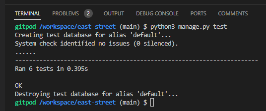
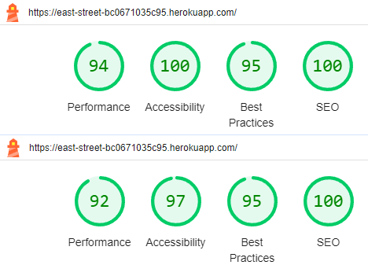

# EastSt. : Testing

_Note: to open links in a new tab, hold CTRL + Click_<br>
_Note: this document only contains testing info for the EastSt. site. If you require full documentation please [click here to access the README.md](README.md) file_

## Table Of Contents
- [Introduction](#eastst---testing)
- [Manual Testing](#manual-testing)
    - [Navigation](#navigation)
    - [Responsiveness](#responsiveness)
    - [Authentication](#authentication)
    - [CRUD Functionality](#crud-functionality)
- [Automated Testing](#automated-testing)
- [Validator Testing](#validator-testing)
    - [W3C](#w3c)
    - [PEP8](#pep8)
    - [JSHint](#jshint)
- [Accessibility & Performance](#accessibility--performance)
    - [WAVE](#wave)
    - [Lighthouse](#lighthouse)
- [Bugs](#bugs)

## Manual Testing

The following sections list a number of manual tests undertaken to ensure the site operates according to details listed under [Scope](README.md#scope) and [Structure](README.md#structure) in the README file. Specific dev goals/user stories can viewed (where appropriate) by hovering over the numbers listed under 'Ref(s)' in the tables below; clicking these links will open the relevant section in the README file.

### Navigation

These tests ensure that a user can successfully navigate the site using the provided navbar links, buttons, and footer icons. The booking area of the site requires a username and password to access (username _testname_ and password _test#123_ have specifically been registered for this purpose); specifics around this access are tested below under [Authentication](#authentication). Note that navigation specific to user-made bookings - i.e. page access using 'Update' and 'Delete' buttons - is covered under [CRUD Functionality](#crud-functionality).

**Test**|**Ref(s)**|**Steps**|**Expected**|**Result**
-----|:-----:|-----|-----|:-----:
Home page displays when using URL|[1.3](README.md#milestone-1---initial-setup "Create an early Heroku deployment to ensure all is working from the very start and allow continuous testing throughout production")<br>[2.1](README.md#milestone-2---main-site-pages "As a Site Visitor/User I want to access info/links from the home page so that I can easily discern information and make a booking")<br>[2.2](README.md#milestone-2---main-site-pages "As a Site Visitor/User I want to view the opening times so that I can see when the restaurant is open before I book")|<ol><li>Type https://east-street-bc0671035c95.herokuapp.com/ into the browser</li><li>Hit 'Enter'</li></ol>|Home page displays with navbar, footer and page contents|Pass
Home page displays when using navbar link|[2.1](README.md#milestone-2---main-site-pages "As a Site Visitor/User I want to access info/links from the home page so that I can easily discern information and make a booking")<br>[2.2](README.md#milestone-2---main-site-pages "As a Site Visitor/User I want to view the opening times so that I can see when the restaurant is open before I book")|<ol><li>Navigate to 'Menu' or 'Location' page</li><li>Click 'Home' in the navbar</li></ol>|Home page displays with navbar, footer and page contents|Pass
Menu page displays when using navbar link|[2.3](README.md#milestone-2---main-site-pages "As a Site Visitor/User I want to view the restaurant menu so that I can see what food is available before booking")|<ol><li>Navigate to 'Home' or 'Location' page</li><li>Click 'Menu' in the navbar</li></ol>|Menu page displays with navbar, footer and page contents|Pass
Location page displays when using navbar link|[2.4](README.md#milestone-2---main-site-pages "As a Site Visitor/User I want to view the location/address of the restaurant so that I know where the restaurant is located")|<ol><li>Navigate to 'Home' or 'Menu' page</li><li>Click 'Location' in the navbar</li></ol>|Location page displays with navbar, footer and page contents|Pass
Home page displays when clicking brand/logo on main site|[2.1](README.md#milestone-2---main-site-pages "As a Site Visitor/User I want to access info/links from the home page so that I can easily discern information and make a booking")<br>[2.2](README.md#milestone-2---main-site-pages "As a Site Visitor/User I want to view the opening times so that I can see when the restaurant is open before I book")|<ol><li>Navigate to 'Menu' or 'Location' page</li><li>Click the brand/logo at the top-left of navbar</ol></li>|Home page displays with navbar, footer and page contents|Pass
Menu page displays when using 'Menu' button|[2.3](README.md#milestone-2---main-site-pages "As a Site Visitor/User I want to view the restaurant menu so that I can see what food is available before booking")|<ol><li>Navigate to 'Home' page</li><li>Reduce screen width until 'Menu' button appears below opening times</li><li>Click 'Menu' button</li></ol>|Menu page displays with navbar, footer and page contents|Pass
Sign In/New Booking form displays when using 'Bookings' navbar link|[3.3](README.md#milestone-3---booking-site-access "As a Site User I want to sign in to the site so that I can make/view/adjust/delete bookings")<br>[4.1](README.md#milestone-4---crud-functionality "As a Site User I want to make an online booking so that I can secure a table for a particular date, time & group size")|<ol><li>Navigate to 'Home' page</li><li>Click 'Bookings' in the navbar</li></ol>|Sign In/New Booking form displays with navbar and footer|Pass
Sign In/New Booking form displays when using 'Book Now' button|[3.3](README.md#milestone-3---booking-site-access "As a Site User I want to sign in to the site so that I can make/view/adjust/delete bookings")<br>[4.1](README.md#milestone-4---crud-functionality "As a Site User I want to make an online booking so that I can secure a table for a particular date, time & group size")|<ol><li>Navigate to 'Home' page</li><li>Click 'Book Now' button</li></ol>|Sign In/New Booking form displays with navbar and footer|Pass
Booking form displays when using 'New Booking' navbar link with correct username|[4.1](README.md#milestone-4---crud-functionality "As a Site User I want to make an online booking so that I can secure a table for a particular date, time & group size")|<ol><li>If required, sign in to booking area using preregistered details e.g. Username: _testname_; Password: _test#123_</li><li>Navigate to 'Current Bookings' page</li><li>Click 'New Booking' in the navbar</li></ol>|Booking form and username displays with navbar and footer|Pass
Current bookings display when using navbar link and only show those made by user|[4.2](README.md#milestone-4---crud-functionality "As a Site User I want to view my booking(s) so that I can see if it has been recorded correctly and remind myself of its details")|<ol><li>If required, sign in to booking area using preregistered details e.g. Username: _testname_; Password: _test#123_</li><li>Navigate to 'New Booking' page</li><li>Click 'Current Bookings' in the navbar</li></ol>|Booking list for signed-in user displays with navbar and footer|Pass
Sign Out page displays when using 'Logout' navbar link|[3.4](README.md#milestone-3---booking-site-access "As a Site User I want to be able to log out from the booking area so that no-one can change my details inadvertently or otherwise")|<ol><li>If required, sign in to booking area using preregistered details e.g. Username: _testname_; Password: _test#123_</li><li>Navigate to 'New Booking' or 'Current Bookings' page</li><li>Click 'Logout' in the navbar</li></ol>|Sign Out page displays with navbar and footer|Pass
Sign Out page displays when clicking brand/logo on booking site|[3.4](README.md#milestone-3---booking-site-access "As a Site User I want to be able to log out from the booking area so that no-one can change my details inadvertently or otherwise")|<ol><li>If required, sign in to booking area using preregistered details e.g. Username: _testname_; Password: _test#123_</li><li>Navigate to 'New Booking' or 'Current Bookings' page</li><li>Click the brand/logo at the top-left of navbar</ol></li>|Sign Out page displays with navbar and footer|Pass
Home page displays when clicking 'Sign Out' button on Sign Out page|[2.1](README.md#milestone-2---main-site-pages "As a Site Visitor/User I want to access info/links from the home page so that I can easily discern information and make a booking")<br>[2.2](README.md#milestone-2---main-site-pages "As a Site Visitor/User I want to view the opening times so that I can see when the restaurant is open before I book")|<ol><li>If required, sign in to booking area using preregistered details e.g. Username: _testname_; Password: _test#123_</li><li>Click 'Logout' in the navbar</li><li>Click 'Sign Out' button</li></ol>|Home page displays with navbar, footer and page contents|Pass
Booking form displays when clicking 'Cancel' button on Sign Out page|[4.1](README.md#milestone-4---crud-functionality "As a Site User I want to make an online booking so that I can secure a table for a particular date, time & group size")|<ol><li>If required, sign in to booking area using preregistered details e.g. Username: _testname_; Password: _test#123_</li><li>Click 'Logout' in the navbar</li><li>Click 'Cancel' button</li></ol>|Booking form and username displays with navbar and footer|Pass
Gmail opens in a new tab/window when clicking footer icon|[2.1](README.md#milestone-2---main-site-pages "As a Site Visitor/User I want to access info/links from the home page so that I can easily discern information and make a booking")|<ol><li>Navigate to any page on the site</li><li>Click email icon in footer|Gmail opens in a new tab/window</li></ol>|Pass
Instagram opens in a new tab/window when clicking footer icon|[2.1](README.md#milestone-2---main-site-pages "As a Site Visitor/User I want to access info/links from the home page so that I can easily discern information and make a booking")|<ol><li>Navigate to any page on the site</li><li>Click Instagram icon in footer</li></ol>|Instagram opens in a new tab/window|Pass
Facebook opens in a new tab/window when clicking footer icon|[2.1](README.md#milestone-2---main-site-pages "As a Site Visitor/User I want to access info/links from the home page so that I can easily discern information and make a booking")|<ol><li>Navigate to any page on the site</li><li>Click Facebook icon in footer</li></ol>|Facebook opens in a new tab/window|Pass
Admin site displays when using URL|[1.1](README.md#milestone-1---initial-setup "Set up Django and its supporting libraries via the IDE in order for development to begin")<br>[1.2](README.md#milestone-1---initial-setup "Set up the Django project and app")<br>[3.1](README.md#milestone-3---booking-site-access "As a Site Admin I want to view all customer details/bookings so that I can plan for required table numbers/sizes")|<ol><li>Type https://east-street-bc0671035c95.herokuapp.com/admin into the browser</li><li>Hit 'Enter'</li><li>Sign in using superuser details (_not provided here for security purposes_)</li></ol>|Admin page displays with Booking system details in left-hand menu|Pass

### Responsiveness

These tests check that the site responds correctly at various sizes of screen, resizing, hiding, and reformatting elements where necessary. The booking area of the site requires a username and password to access (username _testname_ and password _test#123_ have specifically been registered for this purpose); specifics around this access are tested below under [Authentication](#authentication).

**Test**|**Steps**|**Expected**|**Result**
-----|-----|-----|:-----:
Navbar toggler appears on main pages at screen width of 767px or smaller|<ol><li>Navigate to 'Home', 'Menu' or 'Location' page</li><li>Reduce screen width to 767px or smaller</li></ol>|<ul><li>Navbar links no longer display in header</li><li>Toggler appears at right of navbar</li><li>'Home', 'Menu', 'Location', and 'Booking' display when toggler is clicked</li></ol>|Pass
Navbar toggler appears on booking pages at screen width of 767px or smaller|<ol><li>Navigate to 'New Booking' or 'Current Bookings' page</li><li>Reduce screen width to 767px or smaller</li></ol>|<ul><li>Navbar links no longer display in header</li><li>Toggler appears at right of navbar</li><li>'New Booking', 'Current Bookings', and 'Logout' display when toggler is clicked</li></ol>|Pass
Home page adjusts layout at screen width of 767px or smaller|<ol><li>Navigate to 'Home' page</li><li>Reduce screen width to 767px or smaller</li></ol>|<ul><li>'Open' image is hidden</li><li>Header text above opening times is hidden</li><li>'Menu' button appears below opening times</li></ul>|Pass
Menu page adjusts layout at screen width of 767px or smaller|<ol><li>Navigate to 'Menu' page</li><li>Reduce screen width to 767px or smaller</li></ol>|<ul><li>Menu text adjusts from two to one-column layout</li></ul>|Pass
Location page adjusts layout at screen width of 991px or smaller|<ol><li>Navigate to 'Location' page</li><li>Reduce screen width to 991px or smaller</li></ol>|<ul><li>Text below map adjusts from one to two-row layout</li></ul>|Pass
Current Bookings page adjusts layout at screen width of 767px or smaller|<ol><li>Navigate to 'Current Bookings' page</li><li>Reduce screen width to 767px or smaller</li></ol>|<ul><li>'Actions' table header is hidden</li><li>'Update' and 'Delete' buttons repositioned below booking details</li><li>Horizontal borders appear between booking entries</li></ul>|Pass
Current Bookings page adjusts date format at screen width of 767px or smaller|<ol><li>Navigate to 'Current Bookings' page</li><li>Reduce screen width to 767px or smaller</li></ol>|<ul><li>Booking dates adjust from 'Day, Date Month Year' format to 'dd/mm/yyyy'</li></ul>|Pass
Footer adjusts layout at screen width of 767 px or smaller|<ol><li>Navigate to any page on the site</li><li>Reduce screen width to 767px or smaller</li></ol>|<ul><li>'est. 2023' text is hidden</li><li>Social icons right-aligned with screen</li></ul>|Pass
Footer adjusts format at screen width of 575 px or smaller|<ol><li>Navigate to any page on the site</li><li>Reduce screen width to 575px or smaller</li></ol>|<ul><li>Postcode under 'Address' is hidden</li><li>'Wed-Sun' under 'Opening Hours' adjusted to 'W-S'</li></ul>|Pass
Navbar and Footer adjust layout at screen height of 825 px or smaller|<ol><li>Navigate to any page on the site</li><li>Reduce screen height to 825px or smaller</li></ol>|<ul><li>Brand, logo and navbar height reduced</li><li>Social icon size and footer height reduced</li><li>'Opening Hours' text is hidden</li></ul>|Pass

### Authentication

These tests check the sign up, sign in, and sign out functionality of the site which are essential for secure access to the booking area. The username _testname_ and password _test#123_ have specifically been registered to help determine the outcome of these tests.

**Test**|**Ref(s)**|**Steps**|**Expected**|**Result**
-----|:-----:|-----|-----|:-----:
User can sign up to access the booking site|[3.2](README.md#milestone-3---booking-site-access "As a Site Visitor I want to sign up to the site so that I can make bookings")<br>[5.2](README.md#milestone-5---additional-coding "As a Site User I want to have on-screen confirmation during the authorisation/booking process so that I know my input has been recorded correctly")|<ol><li>Click 'Logout' if already signed in, otherwise navigate to Home page</li><li>Click 'Bookings' in the navbar</li><li>Click 'Sign Up' on the sign in form</li><li>Complete all fields with previously unregistered details</li><li>Click 'Sign Up'</li></ol>|<ul><li>User directed to 'New Booking' page</li><li>Alert message confirms sign up as successful</li></ul>|Pass
User cannot sign up unless a username is entered|[3.2](README.md#milestone-3---booking-site-access "As a Site Visitor I want to sign up to the site so that I can make bookings")|<ol><li>Click 'Logout' if already signed in, otherwise navigate to Home page</li><li>Click 'Bookings' in the navbar</li><li>Click 'Sign Up' on the sign in form</li><li>Complete all fields except for 'Username'</li><li>Click 'Sign Up'</li></ol>|<ul><li>Sign-up form will not submit</li><li>Warning prompt alerts user to the problem</li></ul>|Pass
User cannot sign up with previously registered username|[3.2](README.md#milestone-3---booking-site-access "As a Site Visitor I want to sign up to the site so that I can make bookings")|<ol><li>Click 'Logout' if already signed in, otherwise navigate to Home page</li><li>Click 'Bookings' in the navbar</li><li>Click 'Sign Up' on the sign in form</li><li>Complete all fields ensuring 'Username' is filled with previously registered details e.g. _testname_</li><li>Click 'Sign Up'</li></ol>|<ul><li>Sign-up form will not submit</li><li>Text displays saying "A user with that username already exists"</li></ul>|Pass
User can sign up without an email address|[3.2](README.md#milestone-3---booking-site-access "As a Site Visitor I want to sign up to the site so that I can make bookings")<br>[5.2](README.md#milestone-5---additional-coding "As a Site User I want to have on-screen confirmation during the authorisation/booking process so that I know my input has been recorded correctly")|<ol><li>Click 'Logout' if already signed in, otherwise navigate to Home page</li><li>Click 'Bookings' in the navbar</li><li>Click 'Sign Up' on the sign in form</li><li>Complete all fields except for 'Email'</li><li>Click 'Sign Up'</li></ol>|<ul><li>User directed to 'New Booking' page</li><li>Alert message confirms sign up as successful</li></ul>|Pass
User cannot sign up unless a password is entered|[3.2](README.md#milestone-3---booking-site-access "As a Site Visitor I want to sign up to the site so that I can make bookings")|<ol><li>Click 'Logout' if already signed in, otherwise navigate to Home page</li><li>Click 'Bookings' in the navbar</li><li>Click 'Sign Up' on the sign in form</li><li>Complete all fields except for 'Password' and/or 'Password (again)'</li><li>Click 'Sign Up'</li></ol>|<ul><li>Sign-up form will not submit</li><li>Warning prompt alerts user to the problem</li></ul>|Pass
User cannot sign up if passwords don't match|[3.2](README.md#milestone-3---booking-site-access "As a Site Visitor I want to sign up to the site so that I can make bookings")|<ol><li>Click 'Logout' if already signed in, otherwise navigate to Home page</li><li>Click 'Bookings' in the navbar</li><li>Click 'Sign Up' on the sign in form</li><li>Complete all fields ensuring 'Password' and 'Password (again)' contain different data entry</li><li>Click 'Sign Up'</li></ol>|<ul><li>Sign-up form will not submit</li><li>Text displays saying "You must type the same password each time"</li></ul>|Pass
User can sign in to access the booking site|[3.3](README.md#milestone-3---booking-site-access "As a Site User I want to sign in to the site so that I can make/view/adjust/delete bookings")<br>[5.2](README.md#milestone-5---additional-coding "As a Site User I want to have on-screen confirmation during the authorisation/booking process so that I know my input has been recorded correctly")|<ol><li>Click 'Logout' if already signed in, otherwise navigate to Home page</li><li>Click 'Bookings' in the navbar</li><li>Complete all fields with previously registered details e.g. Username: _testname_; Password: _test#123_</li><li>Click 'Sign In'</li></ol>|<ul><li>User directed to 'New Booking' page</li><li>Alert message confirms sign in as successful</li></ul>|Pass
User cannot sign in unless a valid username is entered|[3.3](README.md#milestone-3---booking-site-access "As a Site User I want to sign in to the site so that I can make/view/adjust/delete bookings")|<ol><li>Click 'Logout' if already signed in, otherwise navigate to Home page</li><li>Click 'Bookings' in the navbar</li><li>Complete all fields ensuring 'Username' is filled with previously unregistered details</li><li>Click 'Sign In'</li></ol>|<ul><li>Sign-up form will not submit</li><li>Text displays saying "The username and/or password you specified are not correct"</li></ul>|Pass
User cannot sign in unless a valid password is entered|[3.3](README.md#milestone-3---booking-site-access "As a Site User I want to sign in to the site so that I can make/view/adjust/delete bookings")|<ol><li>Click 'Logout' if already signed in, otherwise navigate to Home page</li><li>Click 'Bookings' in the navbar</li><li>Complete all fields with 'Username' as _testname_ and ensure 'Password' IS NOT _test#123_</li><li>Click 'Sign In'</li></ol>|<ul><li>Sign-up form will not submit</li><li>Text displays saying "The username and/or password you specified are not correct"</li></ul>|Pass
User can sign out from the booking site|[3.4](README.md#milestone-3---booking-site-access "As a Site User I want to be able to log out from the booking area so that no-one can change my details inadvertently or otherwise")<br>[5.2](README.md#milestone-5---additional-coding "As a Site User I want to have on-screen confirmation during the authorisation/booking process so that I know my input has been recorded correctly")|<ol><li>if required sign in, then click 'Logout'</li><li>Click 'Sign Out'</li></ol>|<ul><li>User directed to 'Home' page</li><li>Alert message confirms sign out as successful</li></ul>|Pass

### CRUD Functionality

These tests determine if a user is able to successfully create, view, update and/or delete a booking, or not as the case may be, through the front-end capabilities of the site. In all test cases, **one must first sign in** to the booking area of the site before completing any of the other steps listed (the username _testname_ and password _test#123_ have specifically been registered for this purpose), while the descriptor 'valid details' indicates that the following is expected:

- 'Date' is not left blank
- 'Date' is not set earlier than tomorrow's date
- 'Date' is not set to Monday/Tuesday
- 'Time' is not left blank

**Test**|**Ref(s)**|**Steps**|**Expected**|**Result**
-----|:-----:|-----|-----|:-----:
User can make a booking|[4.1](README.md#milestone-4---crud-functionality "As a Site User I want to make an online booking so that I can secure a table for a particular date, time & group size")<br>[5.2](README.md#milestone-5---additional-coding "As a Site User I want to have on-screen confirmation during the authorisation/booking process so that I know my input has been recorded correctly")|<ol><li>Navigate to 'New Booking' page</li><li>Complete all fields with valid details</li><li>Click 'Submit'</li></ol>|<ul><li>User directed to 'Current Bookings' page</li><li>Submitted details reflected on displayed list</li><li>Alert message confirms booking submitted successfully</li></ul>|Pass
User cannot make a booking unless a date is entered|[4.1](README.md#milestone-4---crud-functionality "As a Site User I want to make an online booking so that I can secure a table for a particular date, time & group size")|<ol><li>Navigate to 'New Booking' page</li><li>Leave 'Date' blank but complete all other fields with valid details</li><li>Click 'Submit'</li></ol>|<ul><li>Booking form will not submit</li><li>Warning prompt alerts user to the problem</li></ul>|Pass
User cannot make a booking unless a time is selected|[4.1](README.md#milestone-4---crud-functionality "As a Site User I want to make an online booking so that I can secure a table for a particular date, time & group size")|<ol><li>Navigate to 'New Booking' page</li><li>Leave 'Time' blank but complete all other fields with valid details</li><li>Click 'Submit'</li></ol>|<ul><li>Booking form will not submit</li><li>Warning prompt alerts user to the problem</li></ul>|Pass
User cannot make a booking on today's date or before|[5.1](README.md#milestone-5---additional-coding "As a Site Admin I want to prevent bookings being made for unavailable dates/times so that bookings are not made when the restaurant is closed")|<ol><li>Navigate to 'New Booking' page</li><li>Set 'Date' earlier than tomorrow's date but complete all other fields with valid details</li><li>Click 'Submit'</li></ul>|<ul><li>Booking form will not submit</li><li>Text displays saying "A booking cannot be made any earlier than tomorrow"</li></ul>|Pass
User cannot make a booking on a Monday or Tuesday|[5.1](README.md#milestone-5---additional-coding "As a Site Admin I want to prevent bookings being made for unavailable dates/times so that bookings are not made when the restaurant is closed")|<ol><li>Navigate to 'New Booking' page</li><li>Set 'Date' to Monday/Tuesday some time after tomorrow's date but complete all other fields with valid details</li><li>Click 'Submit'</li></ul>|<ul><li>Booking form will not submit</li><li>Text displays saying "Sorry, the restaurant is closed on a Monday/Tuesday"</li></ul>|Pass
User can view their previously made bookings|[4.2](README.md#milestone-4---crud-functionality "As a Site User I want to view my booking(s) so that I can see if it has been recorded correctly and remind myself of its details")|<ol><li>Navigate to 'Current Bookings' page</li></ol>|<ul><li>'Current Bookings' page displays user-made bookings</li><li>'Update' buttons appear beside all entries not marked as 'Cancelled'</li><li>'Delete' buttons appear beside all entries</li></ul>|Pass
User can update a booking|[4.3](README.md#milestone-4---crud-functionality "As a Site User I want to access/adjust my booking(s) so that I can correct an error/make necessary changes")<br>[5.2](README.md#milestone-5---additional-coding "As a Site User I want to have on-screen confirmation during the authorisation/booking process so that I know my input has been recorded correctly")|<ol><li>Navigate to 'Current Bookings' page</li><li>Click 'Update' beside any listed booking</li><li>Complete all fields on Update Form with valid details</li><li>Click 'Confirm & Update'</li></ol>|<ul><li>User directed to 'Current Bookings' page</li><li>Updated details reflected on displayed list</li><li>Alert message confirms booking updated successfully</li></ul>|Pass
User cannot update a booking unless a date is entered|[4.3](README.md#milestone-4---crud-functionality "As a Site User I want to access/adjust my booking(s) so that I can correct an error/make necessary changes")|<ol><li>Navigate to 'Current Bookings' page</li><li>Click 'Update' beside any listed booking</li><li>Make 'Date' blank but leave all other fields with valid details</li><li>Click 'Submit'</li></ol>|<ul><li>Update form will not submit</li><li>Warning prompt alerts user to the problem</li></ul>|Pass
User cannot update a booking unless a time is selected|[4.3](README.md#milestone-4---crud-functionality "As a Site User I want to access/adjust my booking(s) so that I can correct an error/make necessary changes")|<ol><li>Navigate to 'Current Bookings' page</li><li>Click 'Update' beside any listed booking</li><li>Make 'Time' blank but leave all other fields with valid details</li><li>Click 'Submit'</li></ol>|<ul><li>Update form will not submit</li><li>Warning prompt alerts user to the problem</li></ul>|Pass
User cannot update a booking to today's date or before|[5.1](README.md#milestone-5---additional-coding "As a Site Admin I want to prevent bookings being made for unavailable dates/times so that bookings are not made when the restaurant is closed")|<ol><li>Navigate to 'Current Bookings' page</li><li>Click 'Update' beside any listed booking</li><li>Set 'Date' earlier than tomorrow's date but leave all other fields with valid details</li><li>Click 'Submit'</li></ol>|<ul><li>Update form will not submit</li><li>Text displays saying "A booking cannot be made any earlier than tomorrow"</li></ul>|Pass
User cannot update a booking to a Monday or Tuesday|[5.1](README.md#milestone-5---additional-coding "As a Site Admin I want to prevent bookings being made for unavailable dates/times so that bookings are not made when the restaurant is closed")|<ol><li>Navigate to 'Current Bookings' page</li><li>Click 'Update' beside any listed booking</li><li>Set 'Date' to Monday/Tuesday some time after tomorrow's date but leave all other fields with valid details</li><li>Click 'Submit'</li></ol>|<ul><li>Update form will not submit</li><li>Text displays saying "Sorry, the restaurant is closed on a Monday/Tuesday"</li></ul>|Pass
User cannot update other users' bookings|[5.3](README.md#milestone-5---additional-coding "Set up 404, 403 and 500 pages to correctly handle access/server issues when the site is in use")|<ol><li>Navigate to 'Current Bookings' page</li><li>Click 'Update' beside any listed booking</li><li>In the page URL, change the digit given before '/update' to '10' so the URL reads https://east-street-bc0671035c95.herokuapp.com/10/update/</li><li>Hit 'Enter'</li></ol>|<ul><li>Update form for this entry not displayed to user</li><li>User redirected to 403 Error page</li>|Pass
Bookings marked as 'Confirmed' change to 'Pending' when updated|[4.3](README.md#milestone-4---crud-functionality "As a Site User I want to access/adjust my booking(s) so that I can correct an error/make necessary changes")<br>[5.2](README.md#milestone-5---additional-coding "As a Site User I want to have on-screen confirmation during the authorisation/booking process so that I know my input has been recorded correctly")|<ol><li>Navigate to 'Current Bookings' page</li><li>Click 'Update' beside any booking marked as 'Confirmed'</li><li>Complete all fields on Update Form with valid details</li><li>Click 'Confirm & Update'</li></ol>|<ul><li>User directed to 'Current Bookings' page</li><li>Updated details reflected on displayed list with status set to 'Pending'</li><li>Alert message confirms booking updated successfully</li></ul>|Pass
User can delete a booking|[4.4](README.md#milestone-4---crud-functionality "As a Site User I want to cancel my booking(s) so that it/they no longer appear(s) on the system")<br>[5.2](README.md#milestone-5---additional-coding "As a Site User I want to have on-screen confirmation during the authorisation/booking process so that I know my input has been recorded correctly")|<ol><li>Navigate to 'Current Bookings' page</li><li>Click 'Delete' beside any listed booking</li><li>Click 'Confirm & Delete'</li></ol>|<ul><li>User directed to 'Current Bookings' page</li><li>Appropriate details removed from displayed list</li><li>Alert message confirms booking deleted successfully</li></ul>|Pass
User cannot delete other users' bookings|[5.3](README.md#milestone-5---additional-coding "Set up 404, 403 and 500 pages to correctly handle access/server issues when the site is in use")|<ol><li>Navigate to 'Current Bookings' page</li><li>Click 'Delete' beside any listed booking</li><li>In the page URL, change the digit given before '/delete' to '10' so the URL reads https://east-street-bc0671035c95.herokuapp.com/10/delete/</li><li>Hit 'Enter'</li></ol>|<ul><li>Deletion form for this entry not displayed to user</li><li>User redirected to 403 Error page</li>|Pass
Admin can change status of bookings made by users|[4.5](#milestone-4---crud-functionality "As a Site Admin I want to have the ability to accept/reject new bookings so that I can manage customer numbers within the restaurant")|<ol><li>Navigate to Admin site</li><li>Sign in using superuser details (_not provided here for security purposes_)</li><li>Click 'Bookings' in the left-hand menu</li><li>Select an individual booking from the list displayed</li><li>Adjust the value under 'Status' and click 'SAVE'</li></ol>|<ul><li>Admin directed back to list of bookings</li><li>Success message displayed at top of screen</li>|Pass

## Automated Testing

A number of automated tests have been written to provide additional validation alongside those manual tests which check for a user's ability to view the booking section, depending on whether or not they are authenticated, as well as attempts to update/delete bookings which do not belong to a user.

All of these tests are found within the [tests.py](booking_sys/tests.py) file in the repository.



## Validator Testing

### W3C
All pages have been passed through the [W3C HTML Validator](https://validator.w3.org/) successfully save for a few minor issues which have been left 'as is' as attempts to correct them proved unsuccessful and lead to results which devalued the user experience. Specifically, these were:

- The use of a 'background' attribute in the body tag of base.html. The validator suggested to replace this with CSS but attempts to do so meant the background image failed to load
- The use of iframe styling attributes on the location.html page. Again, the validator suggested CSS replacements but these caused the map to display incorrectly and almost be unreadable

### PEP8
All Python files in the booking_sys and eaststreet apps, as well env.py and manage.py, have been passed through the [Code Institute PEP8 Linter](https://pep8ci.herokuapp.com/). The only warnings given were for the settings.py file which contains a small number of long lines (i.e. greater than 80 characters) under AUTH_PASSWORD_VALIDATORS; as this is code implemented by Django itself at setup, these lines will be left unchanged. 

### JSHint
The small JavaScript snippet under the footer of base.html has been passed through [JShint](https://jshint.com/) without issue.

## Accessibility & Performance

### WAVE
The site has been tested using the [WAVE Evaluation Tool](https://wave.webaim.org/report#/https://east-street-bc0671035c95.herokuapp.com/) to ensure best practices have been followed regarding aria labels, heading hierarchy, and contrast between page elements. An initial valuation revealed that the 'Sign Up'/'Sign In' forms had a minor contrast issue with links so this has been corrected for better readability.

### Lighthouse
[Lighthouse](https://developer.chrome.com/docs/lighthouse/overview/) was used to used to produce reports on performance and accessibility for both desktop and mobile versions of the site. The image below shows results for the Home page on desktop and mobile respectively while sitewide results are provided in the table. In all cases the SEO score was 100 which was achieved after adding meta 'keyword' and 'description' tags to the base.html head section.



| | |**Desktop**| | |**Mobile**| |
:-----|:-----:|:-----:|:-----:|:-----:|:-----:|:-----:
**Page**|**Performance**|**Accessibility**|**Best Practices**|**Performance**|**Accessibility**|**Best Practices**
**Home**|94|100|95|92|97|95
**Menu**|99|100|95|92|100|95
**Location**|97|97|91|92|97|91
**New Bookings**|98|100|91|92|100|95
**Current Bookings**|98|100|95|91|100|91
**Sign In**|98|100|95|92|100|95
**Sign Up**|98|100|95|92|100|95
**Sign Out**|98|100|95|92|100|95
**_Averages_**|**_98_**|**_100_**|**_94_**|**_92_**|**_99_**|**_94_**

## Bugs

There are no known bugs in the current deployment of the site. A number of bugs were found, added to the [Kanban workflow](https://github.com/users/ndsurgenor/projects/5), and corrected during development. A brief summary of these bugs is provided below:

**Type**|**Issue**|**Detail**|**Solution**|**Result**
-----|-----|-----|-----|:-----:
Style|Bootstrap/CSS styling not displaying correctly|Heroku deployment not displaying the Bootstrap/CSS styling as implemented in the code. Running a server using ```python3 manage.py runserver``` displays all styling correctly|<ul><li>Connect style.css by correcting typo of 'STATIC\_DIRS' to 'STATICFILES\_DIRS' in settings.py</li><li>Set images to load from static links rather than external sources</li></ul>|Fixed
Style|Pages not scrolling correctly|On smaller screen heights the contents of the page will not scroll correctly to show content hidden behind the footer|<ul><li>Add margin-bottom to body under media query</li><li>Add margin-bottom divs on relevant pages where required e.g. Menu page</li></ul>|Fixed
Style|Sign up/sign in form not displaying correctly on iphone/iPad|Form is rendering correctly but input fields are extending beyond the form border|<ul><li>Relevant input id tags added to style.css</li><li>Width set to 50%</li></ul>|Fixed
Data|Booking form not recording submissions on database|Form is rendering correctly as a functional object but not storing data to the database|<ul><li>'Status' included on form as a hidden field to ensure this present when form is submitted</li><li>Code added to form_valid to automatically set contact info (form.instance.contact_id = self.request.user.id)as this was also missing from the form</li></ul>|Fixed
Deployment|Site failed to deploy to Heroku|Heroku build log displaying error ```Could not build wheels for backports.zoneinfo, which is required to install pyproject.toml-based projects```|<ul><li>[Stack Overflow](https://stackoverflow.com/questions/71712258/error-could-not-build-wheels-for-backports-zoneinfo-which-is-required-to-insta) referenced for solution</li><li>requirements.txt updated with ```backports.zoneinfo==0.2.1;python_version<"3.9"```</li></ul>|Fixed